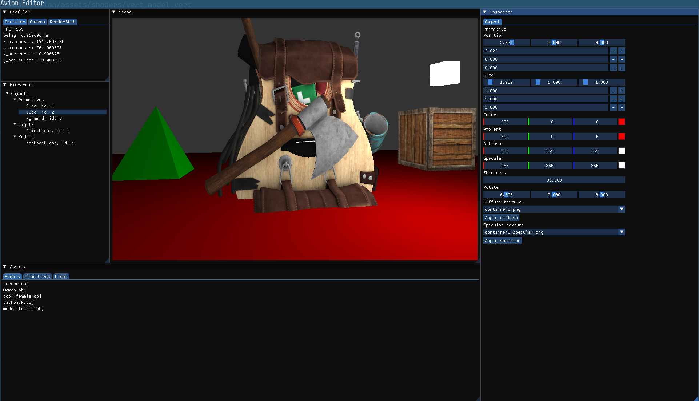

# Avion - 3D/2D OpenGL Engine

Avion - это мой 3D/2D-движок на C++ и OpenGL.

## Цель проекта

Геймдев всегда был одной из причин, по которой я начал заниматься программированием.  

Проект совмещает мой интерес к геймдеву, системному программированию и архитектуре. В рамках движка я экспериментирую с новыми для себя подходами, архитектурными решениями и низкоуровневыми механизмами.

## Технологии

Для разработки используются:

- C++23
- CMake
- OpenGL 4.6
- GLFW
- GLAD
- GLM
- ImGui
- Assimp
- stb
- Arch Linux
- GCC 16.1.1
- Vim / VSCode

## Third-party зависимости

Проект использует следующие сторонние библиотеки:

- Assimp - загрузка 3D-моделей
- ImGui - интерфейс редактора
- GLM - математические типы и операции
- stb - работа с изображениями
- GLFW - создание окна и обработка ввода
- GLAD - загрузка OpenGL-функций

Зависимости подключаются через `git submodule`.

В будущем планируется переход на `CMake FetchContent`.

## Поддерживаемые платформы

На текущий момент проект гарантированно собирается и запускается на Arch Linux.

Также проект собирался с небольшими правками под macOS на MacBook с M-чипом, но эти изменения пока не внесены в основную ветку.

## Сборка проекта

Клонируйте репозиторий вместе с submodules:

```shell
git clone --recurse-submodules https://github.com/lpdgrl/avion.git
cd avion
```

В корне репозитория находятся bash-скрипты для сборки и запуска:

```shell
chmod +x build.sh run.sh
./build.sh
./run.sh
```

Или одной командой:

```shell
chmod +x build.sh run.sh && ./build.sh && ./run.sh
```

## Текущее состояние проекта

На данный момент реализовано:

- базовое освещение по модели Phong;
- загрузка `.obj`-моделей через Assimp;
- базовая система сцены;
- базовый редактор на ImGui;
- рендеринг сцены во framebuffer;
- отображение результата рендера внутри редактора;
- разделение core-функционала и editor-функционала;
- подключение core-функционала как динамической библиотеки.

## Architecture

Проект разделён на две основные части:

- `core` - рендеринг, сцена, ресурсы, модели, материалы;
- `editor` - GUI, panels, editor-specific logic.

Core-функционал собирается в динамическую библиотеку и используется редактором.

## Планы

В ближайших планах:

- сохранение и загрузка сцены в/из JSON;
- добавление gizmo для трансформаций объектов;
- улучшение системы материалов;
- развитие resource manager;
- улучшение архитектуры renderer pipeline;
- поддержка дополнительных форматов моделей;
- постепенное внедрение собственных STL-подобных контейнеров и утилит под задачи движка.

## Disclaimer

Проект находится в активной разработке и используется в первую очередь как исследовательский pet-project.

Некоторые архитектурные решения могут меняться по мере развития движка.

## Demo



